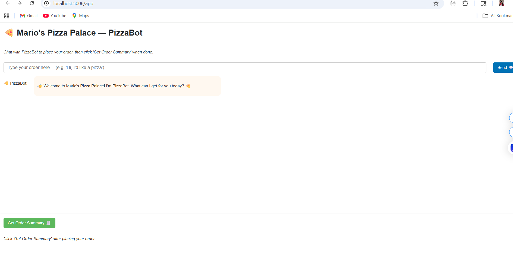

# 🍕 Mario's Pizza Palace — PizzaBot

Interactive pizza ordering chatbot built with Panel + Groq AI.

## 🚀 Quick Start

1. Clone the repo
2. Install dependencies: `pip install -r requirements.txt`
3. Copy `.env.example` to `.env` and add your Groq API key
4. Run: `panel serve app.py --show`

## Features

- AI-powered pizza ordering
- Real-time order validation
- Automatic receipt generation
- Delivery/pickup options

## Menu

[Include your MENU data here]# 🍕 Mario's Pizza Palace — PizzaBot

Interactive pizza ordering chatbot built with Panel + Groq AI.

## 🚀 Quick Start

1. Clone the repo
2. Install dependencies: `pip install -r requirements.txt`
3. Copy `.env.example` to `.env` and add your Groq API key
4. Run: `panel serve app.py --show`

## Features

- AI-powered pizza ordering
- Real-time order validation
- Automatic receipt generation
- Delivery/pickup options

## 📸 Screenshot

